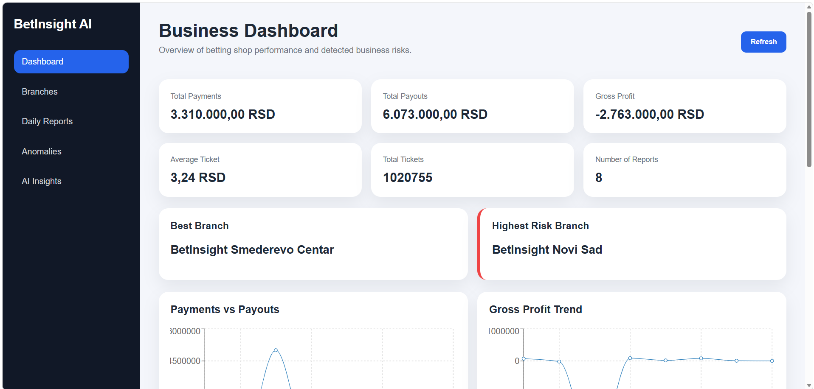
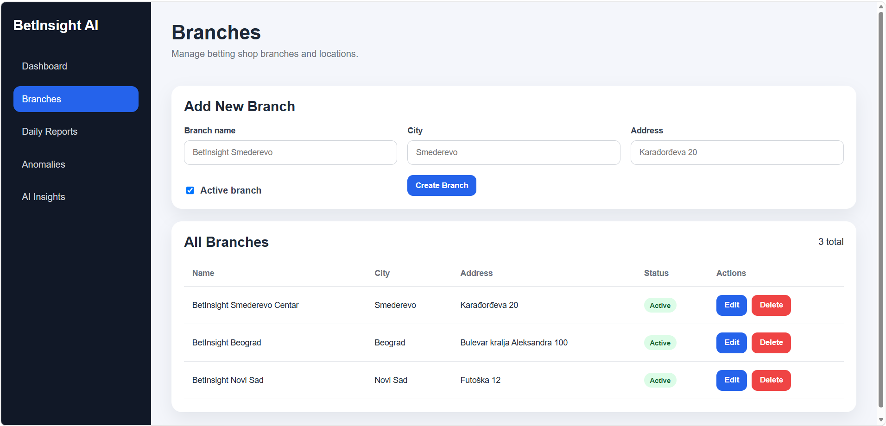
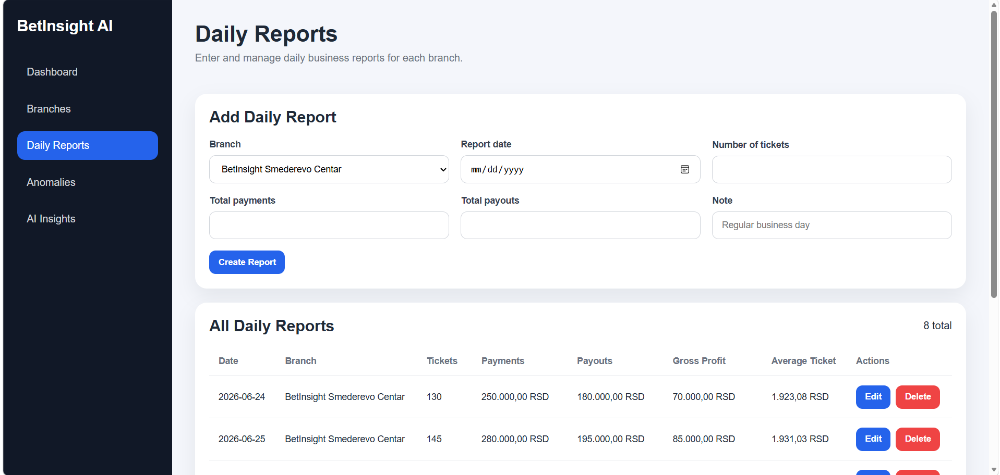
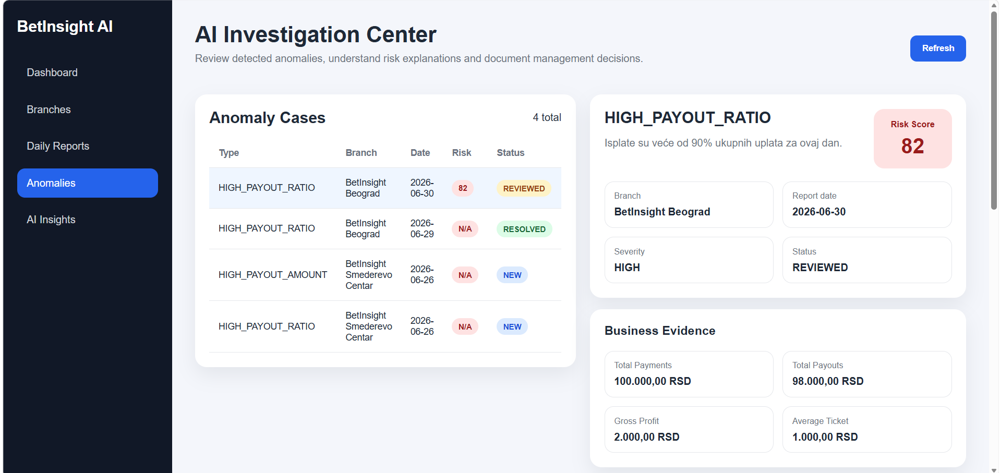
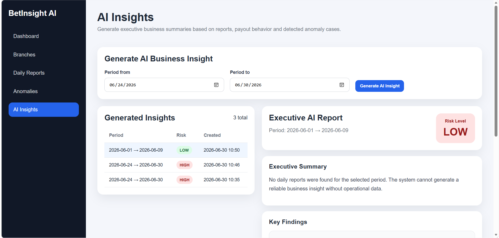

\# BetInsight AI


BetInsight AI is a full-stack business intelligence and explainable AI risk investigation platform for betting operations.


The project is not a betting prediction tool. It focuses on operational analytics, anomaly detection, risk investigation, internal control and AI-assisted business reporting.


\## Main Idea


Traditional dashboards show numbers. BetInsight AI goes one step further by detecting unusual business patterns and explaining why they may require management attention.


The system helps managers:


\- monitor branch performance

\- analyze daily payments and payouts

\- detect unusual payout behavior

\- investigate anomaly cases

\- generate AI-style executive business reports

\- document manager reviews and decisions


\## Key Features


\### Branch Management


\- Create, update, delete and list betting shop branches

\- Track branch name, city, address and active status


\### Daily Business Reports


\- Enter daily reports for each branch

\- Track number of tickets, payments and payouts

\- Automatically calculate gross profit

\- Automatically calculate average ticket amount


\### Analytics Dashboard


\- Total payments

\- Total payouts

\- Gross profit

\- Average ticket amount

\- Total number of tickets

\- Number of daily reports

\- Best performing branch

\- Highest risk branch


\### Charts


\- Payments vs payouts trend

\- Gross profit trend

\- Branch performance comparison


\### Anomaly Detection


The system automatically detects anomaly cases when a new daily report is created or updated.


Current anomaly rules:


\- HIGH\_PAYOUT\_RATIO: payouts are above 90% of payments

\- HIGH\_PAYOUT\_AMOUNT: payouts are more than 50% higher than the branch average

\- NEGATIVE\_PROFIT: payouts are higher than payments


\### AI Investigation Center


Each anomaly becomes an investigation case with:


\- risk score

\- business evidence

\- AI-style explanation

\- recommended actions

\- case status

\- manager note

\- review timestamp


Available case statuses:


\- NEW

\- REVIEWED

\- RESOLVED

\- ESCALATED


\### AI Business Insights


The system generates executive business reports for a selected period.


Each AI insight contains:


\- executive summary

\- key findings

\- recommended actions

\- overall risk level


\## Screenshots


\### Dashboard




\### Branch Management




\### Daily Reports




\### AI Investigation Center




\### AI Insights



\## Tech Stack


\### Backend


\- Java 21

\- Spring Boot

\- Spring Web

\- Spring Data JPA

\- Hibernate

\- MySQL

\- Maven


\### Frontend


\- React

\- Vite

\- Recharts

\- CSS


\### Database


\- MySQL


\## Project Structure


```text

bet-insight-ai/

│

├── backend/

│   └── Spring Boot REST API

│

├── frontend/

│   └── React dashboard application

│

├── docs/

│   └── project documentation and screenshots

│

└── README.md

